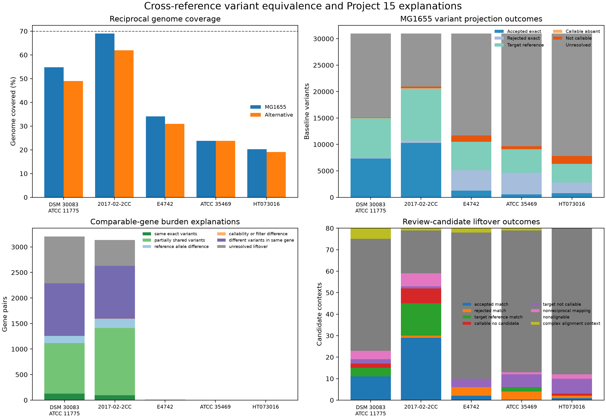

# Project 16 — Cross-Reference Variant Liftover & Gene-Burden Explanation Explorer

Project 16 extends Project 15 from corresponding genes to exact variants.

```text
Project 15: Do corresponding genes have similar variant burdens?
Project 16: Are those burdens caused by the same exact variants?
```

The workflow reuses the six Project 13 reference-relative callsets and Project
15's orthology, annotation, gene-burden, and review-candidate results. It does
not introduce a new sample or remap the reads.



## Main finding

Project 15's gene-level similarity is only partly explained by the same exact
variants. Of 30,973 MG1655-relative variants, 14,409 matched at least one
alternative reference exactly after reciprocal coordinate translation and
allele normalization. Only two matched all five alternatives.

For the 6,356 comparable gene pairs:

- 2,303 contained partially shared exact variants;
- 2,075 contained different variants in the corresponding gene;
- 1,428 remained unresolved at exact-variant resolution;
- 324 were explained primarily by a reference-allele difference; and
- only 24 non-empty gene pairs had completely identical exact variant sets.

When an accepted exact allele landed inside the paired one-to-one ortholog,
14,201 of 14,280 retained the same predicted consequence and impact.

## What the workflow does

```text
Six reference FASTAs + six reference-relative callsets
  → ten directional whole-genome alignments
  → base-level coordinate and allele translation
  → target-reference re-expression and left normalization
  → independent reverse projection
  → accepted/rejected/callability evidence classification
  → exact-variant equivalence clusters
  → Project 15 gene-burden explanations
```

An exact match requires the projected allele to return to the original
normalized source key through the independently generated reverse alignment.
Repeats, gaps, rearrangement boundaries, missing contigs, and nonreciprocal
mappings remain explicit unresolved outcomes.

## Reproducible inputs

| Input | Identity |
|---|---|
| Sample | `SRR13921545` |
| Baseline | MG1655 RefSeq `GCF_000005845.2` |
| Alternative references | `GCF_003697165.2`, `GCF_036503815.1`, `GCF_005843885.1`, `GCF_000026225.1`, `GCF_002900365.1` |
| Variant evidence | Project 13 accepted, evaluated, and rejected VCFs plus callable BED files |
| Gene evidence | Project 15 annotations, one-to-one orthology, burden tables, and review contexts |

Exact reference and VCF hashes are in
[`data/reference_manifest.csv`](data/reference_manifest.csv). See
[data provenance](docs/data_provenance.md) for the complete inherited chain.

## Milestone 1 result

The connection review passed:

| Check | Result |
|---|---:|
| References | 6 |
| Directional whole-genome alignments | 10 |
| PAF records | 1,669 |
| Qualifying primary blocks | 472 |
| Blocks with a reciprocal counterpart | 439 |
| Project 15 accepted variants reproduced | 357,581 |
| Project 15 annotation effects reproduced | 357,959 |
| Project 15 comparable gene pairs reproduced | 6,356 |
| Review-candidate contexts reproduced | 400 |

All reference, accepted/evaluated/rejected VCF, index, and callable-BED
checksums remained unchanged.

The 70% reciprocal-coverage threshold is intentionally strict. None of the
five alternatives passed it, so every alternative remains audit-only. The
closest was 2017-02-2CC, with 68.99% of MG1655 and 61.97% of the alternative
genome covered by qualifying reciprocal blocks. This does not prevent the
next milestone from measuring exact liftover outcomes, but it limits how
broadly those outcomes can be interpreted.

See the complete [connection review](docs/connection_review.md) and
[`reciprocal_coverage.csv`](results/connection_review/tables/reciprocal_coverage.csv).

## Milestone 2 result

The conservative liftover engine is implemented and verified with 12 explicit
small-variant cases. The engine reads Minimap2 PAF records with long `cs` and
extended CIGAR strings, maps the complete source REF span, handles reverse
strands, normalizes projected alleles with BCFtools, and requires the projected
allele to return to the original normalized source key through the reverse
alignment.

| Controlled outcome | Count |
|---|---:|
| Accepted exact match | 4 |
| Rejected exact match | 1 |
| Target reference already matches the sample allele | 1 |
| Callable target with no matching candidate | 1 |
| Target position not callable | 1 |
| Ambiguous mapping | 1 |
| Nonreciprocal mapping | 1 |
| Nonalignable | 1 |
| Complex alignment context | 1 |

The four accepted examples comprise a forward-strand SNP, insertion, deletion,
and reverse-strand SNP. A compressed, indexed controlled VCF contains the seven
projected non-reference alleles that reached evidence classification. Outputs
are written to a staging directory and renamed into place only after all checks
pass; the failure-path test confirms that incomplete stages are removed.

See the [core liftover review](docs/core_liftover.md) and
[`controlled_projections.csv`](results/controlled_core/tables/controlled_projections.csv).

## Milestone 3 result

The Project 15 integration layer now joins a baseline projection to its
one-to-one ortholog, the selected highest-impact effect for each `(variant,
gene)`, the inherited burden comparison, and the review-candidate context.
Every comparable gene pair receives exactly one explanation:

- `same_exact_variants`
- `partially_shared_variants`
- `reference_allele_difference`
- `callability_or_filter_difference`
- `different_variants_in_same_gene`
- `unresolved_liftover`

All six categories are demonstrated once in controlled data. The examples also
cover identical consequences, different consequences with the same impact,
different impacts, and missing target-gene effects. Unresolved coordinate or
allele evidence takes precedence over a partial match.

A read-only bridge audit reproduced the actual Project 15 inputs: 6,356
comparable gene pairs, 327,542 distinct variant–gene assignments, 357,959
annotation effects, 28,859 gene-burden rows, and all 400 review contexts for 80
MG1655 variants. Inherited checksums remained unchanged. Authentic liftover
outcomes have not yet been assigned.

See the [Project 15 integration review](docs/project15_integration.md), the
[`project15_burden_explanation.csv`](results/controlled_integration/tables/project15_burden_explanation.csv)
fixture, and the
[`project15_bridge_counts.csv`](results/project15_integration_review/tables/project15_bridge_counts.csv)
audit.

## Milestone 4 result

The full authentic analysis is complete. All 481,473 directional projection
attempts were assigned exactly one outcome, including the required 154,865
MG1655-variant-by-alternative comparisons. The run produced 40,418 accepted
directional exact-match edges and grouped all 357,581 inherited variants into
337,372 equivalence clusters.

Across the five alternatives, 14,409 of the 30,973 MG1655-relative variants
had at least one accepted exact match. The strongest individual recovery was
10,303 variants in 2017-02-2CC, followed by 7,350 in DSM 30083 / ATCC 11775.
Only two MG1655 variants matched all five alternatives.

The exact-variant evidence changed how Project 15's 6,356 comparable gene pairs
should be read:

| Explanation | Gene pairs |
|---|---:|
| Partially shared variants | 2,303 |
| Different variants in the same gene | 2,075 |
| Unresolved liftover | 1,428 |
| Reference-allele difference | 324 |
| Same exact variant set | 225 |
| Callability or filter difference | 1 |

Of the 225 pairs labelled as the same exact set, 201 are zero-versus-zero
pairs; only 24 contain shared exact variants. Among the 14,280 accepted exact
matches located inside the paired ortholog, 14,201 retained the same predicted
consequence and impact.

See the full [authentic analysis](docs/authentic_analysis.md), the
[`project15_burden_explanation.csv`](results/authentic_analysis/tables/project15_burden_explanation.csv),
and the
[`variant liftover dashboard`](results/authentic_analysis/dashboard/variant_liftover_dashboard.png).

## Milestone 5 result

The comprehensive quality review passed all 97 Python 3.12 test cases with no
failures, errors, or skips. The suite covers malformed FASTA/VCF/BED/PAF input,
SNPs, insertions, deletions, repeat normalization, reverse strands, multiple
contigs, missing plasmids, circular-origin spans, ambiguous repeats,
rearrangement gaps, allele swaps, callability states, duplicate keys, native
tool failures, exact accounting, and atomic cleanup.

The review hardened PAF, VCF, and BED validation; rejects duplicate source
variants and overlapping accepted/rejected evidence before projection; and
reports circular-origin alleles as requiring pre-splitting. All authentic and
inherited checksums remained unchanged.

See the [quality review](docs/quality_review.md) and the
[`test_matrix.csv`](results/quality_review/test_matrix.csv).

## Command-line interface

```text
variant-liftover-explorer
  --reference-manifest REFERENCE_MANIFEST.csv
  --project15-comparison-dir PROJECT15_COMPARISON_DIRECTORY
  --project15-orthology-dir PROJECT15_ORTHOLOGY_DIRECTORY
  --project15-annotation-dir PROJECT15_ANNOTATION_DIRECTORY
  --baseline-accession GCF_000005845.2
  --sample-id SRR13921545
  --alignment-preset asm20
  --minimum-alignment-length 10000
  --minimum-alignment-identity 0.85
  --minimum-alignment-mapq 20
  --ambiguity-score-fraction 0.95
  --minimum-comparable-coverage 0.70
  --threads 1
  --output-dir NEW_OUTPUT_DIRECTORY
```

The command validates all inherited inputs, generates the ten alignments, runs
the complete reciprocal projection and Project 15 integration, and publishes
one complete output directory. The output directory must not already exist.
See the [environment and execution guide](docs/environment_setup.md) for an
executable example.

## Outputs

A complete CLI run produces:

- ten directional PAF files and sanitized native logs;
- connection-review tables and reciprocal coverage evidence;
- `variant_projections.csv.gz` with every directional attempt;
- `baseline_variant_comparison.csv` with five rows per MG1655 variant;
- `variant_equivalence_clusters.csv`;
- normalized projected and exact-equivalence VCFs with CSI indexes;
- `ortholog_variant_equivalence.csv`;
- `project15_burden_explanation.csv`;
- `review_candidate_liftover.csv`;
- projection, effect, callability, burden, and review summaries;
- the four-panel dashboard; and
- nested and top-level manifests containing parameters, commands, versions,
  checksums, and totals.

The portfolio repository keeps compact result tables and VCFs. Native PAFs,
copied references, and temporary normalization files remain under ignored
`local/` storage.

## Environment

The scientific workflow runs in Linux or Ubuntu through WSL2:

```bash
micromamba create -f environment.yml
micromamba activate variant-liftover-explorer
python -m pip install --no-build-isolation --no-deps -e .
python -m pytest -q -p no:cacheprovider
```

Pinned tools are Python 3.12, Minimap2 2.31, BCFtools 1.24, Samtools 1.24,
Matplotlib 3.11.1, and pytest 9.0.2. The same offline suite runs on Ubuntu in
GitHub Actions.

## Documentation

- [Methods](docs/methods.md)
- [Data provenance](docs/data_provenance.md)
- [Linux and WSL2 setup](docs/environment_setup.md)
- [Limitations](docs/limitations.md)
- [References](docs/references.md)
- [Connection review](docs/connection_review.md)
- [Core liftover review](docs/core_liftover.md)
- [Project 15 integration](docs/project15_integration.md)
- [Authentic analysis](docs/authentic_analysis.md)
- [Quality review](docs/quality_review.md)
- [Publication checklist](docs/publication_checklist.md)

## Portfolio progression

1. [Project 11 — Paired-End Mapping & Fragment QC Explorer](https://github.com/pankhilpandya01-star/bioinformatics-project-11-paired-end-fragment-qc-explorer)
2. [Project 12 — Small-Variant Calling & Evidence QC Explorer](https://github.com/pankhilpandya01-star/bioinformatics-project-12-small-variant-evidence-qc-explorer)
3. [Project 13 — Sample Identity & Reference Concordance Explorer](https://github.com/pankhilpandya01-star/bioinformatics-project-13-sample-identity-reference-concordance-explorer)
4. [Project 14 — Variant Annotation & Predicted Gene Consequence Explorer](https://github.com/pankhilpandya01-star/bioinformatics-project-14-variant-annotation-gene-consequence-explorer)
5. [Project 15 — Cross-Reference Gene Orthology & Consequence Explorer](https://github.com/pankhilpandya01-star/bioinformatics-project-15-cross-reference-gene-orthology-consequence-explorer)
6. [Project 16 — Cross-Reference Variant Liftover & Gene-Burden Explanation Explorer](https://github.com/pankhilpandya01-star/bioinformatics-project-16-cross-reference-variant-liftover-gene-burden-explorer)
   (this repository)

## Interpretation boundary

An exact normalized allele match supports equivalence under the tested
reference alignments. It does not prove when a mutation arose, identical gene
function, phenotype, antimicrobial resistance, or clinical significance.

Milestone 1 measures whether reliable coordinate translation is feasible. It
does not yet claim that any Project 13 variants are equivalent.

Milestone 2 validates the projection mechanics on controlled data. Authentic
Project 13 variants are not interpreted until the Project 15 integration and
full comparison milestones.

Milestone 3 validates Project 15 joins and explanation rules without assigning
biological meaning to the controlled examples.

Milestone 4 measures exact equivalence only where the fixed whole-genome
alignment, reciprocal validation, target reference, normalization, and target
evidence all agree. An unresolved or unmatched projection is not proof that an
allele is biologically absent.

Milestone 5 verifies the implementation and authentic artifacts under normal,
edge-case, and injected-failure conditions.

The audited project is published at
[GitHub](https://github.com/pankhilpandya01-star/bioinformatics-project-16-cross-reference-variant-liftover-gene-burden-explorer).
See the [publication checklist](docs/publication_checklist.md).

## License

This project is released under the [MIT License](LICENSE).
